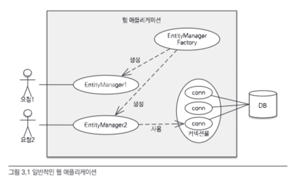
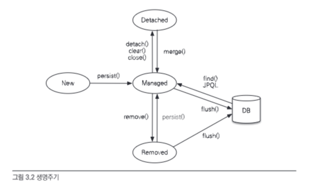
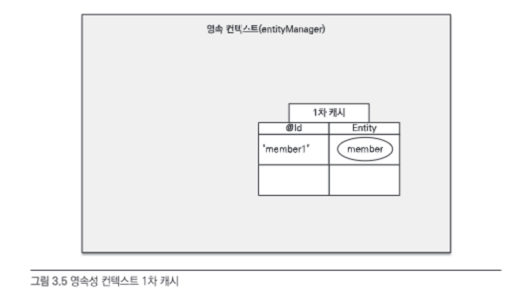
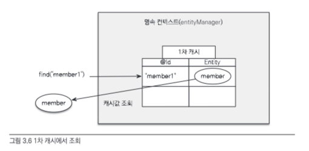
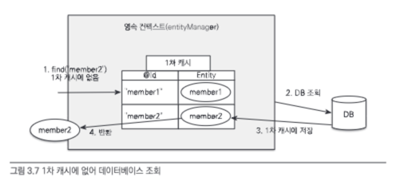

# Chapter 3. 영속성 관리

이 장에서는 매핑한 엔티티를 엔티티 매니저를 통해 어떻게 사용하는지 알아보겠습니다.

## 엔티티 매니저 팩토리와 엔티티 매니저

데이터베이스를 하나만 사용하는 애플리케이션은 일반적으로 `EntityManagerFactory`를 하나만 생성한다.

```java
// 비용이 많이 드는 작업이므로 애플리케이션 전체에서 딱 한 번만 생성하고 공유해서 사용한다.
EntityManagerFactory emf = Persistence.createEntityManagerFactory("jpabook");

// 팩토리에서 엔티티 매니저를 생성, 비용이 거의 안든다
EntityManager em = emf.createEntityManager();
```



- 엔티티 매니저 팩토리 : Thread-safe하므로 여러 스레드가 동시에 접근해도 안전하다.
- 엔티티 매니저 : Thread-safe하지 않으므로 여러 스레드가 동시에 접근하면 동시성 문제가 발생한다.

위 그림을 보면 팩토리에서 다수의 엔티티 매니저를 생성해서 사용하는 것을 알 수 있다. 엔티티 매니저는 데이터베이스 연결이 꼭 필요한 시점까지 커넥션을 얻지 않는다. 따라서 엔티티 매니저를 생성할 때 데이터베이스 커넥션을 획득하지 않는다.
예를 들어, 트랜잭션을 시작할 때 커넥션을 획득한다.

## 영속성 컨텍스트란?

JPA를 이해하는 데 가장 중요한 용어는 `영속성 컨텍스트(persistence context)`다.

> `영속성 컨텍스트`는 엔티티를 영구 저장하는 환경이다. 논리적인 개념이며 눈에 보이지 않는다.
> 
> `em.persist(member);` 를 통해 영속성 컨텍스트에 저장된다.

## 엔티티의 생명주기

- 비영속(new/transient) : 영속성 컨텍스트와 전혀 관계가 없는 새로운 상태
- 영속(managed) : 영속성 컨텍스트에 관리되는 상태
- 준영속(detached) : 영속성 컨텍스트에 저장되었다가 분리된 상태
- 삭제(removed) : 삭제된 상태



### 비영속

엔티티 객체를 생성한 상태. 순수한 객체 상태이며 아직 JPA와는 관계가 없다.

```java
// 객체를 생성한 상태(비영속)
Member member = new Member();
member.setId("member1");
member.setUsername("회원1");
```

### 영속

엔티티 매니저를 통해 엔티티를 영속성 컨텍스트에 저장한 상태. 영속성 컨텍스트에 의해 관리되는 상태이다.

```java
// 객체를 저장한 상태(영속)
em.persist(member);
```

### 준영속

영속성 컨텍스트가 관리하던 영속 상태의 엔티티를 영속성 컨텍스트가 관리하지 않는 상태. 

특정 엔티티를 준영속 상태로 만들려면 `em.detach(entity)`를 호출하면 된다. (em.close(), em.clear()를 호출해도 준영속 상태가 된다.)

```java
// 회원 엔티티를 영속성 컨텍스트에서 분리, 준영속 상태
em.detach(member);
```

### 삭제

엔티티를 영속성 컨텍스트와 데이터베이스에서 삭제한 상태 

```java
// 객체를 삭제한 상태(삭제)
em.remove(member);
```

## 영속성 컨텍스트의 특징

- 영속성 컨텍스트와 식별자 값
  - 영속성 컨텍스트는 @Id로 식별자를 매핑한 엔티티를 식별자 값으로 사용한다. 따라서 영속 상태는 식별자 값이 반드시 있어야 한다. 식별자 값이 없으면 예외가 발생한다.
- 영속성 컨텍스트와 데이터베이스 저장
  - 트랜잭션을 커밋하는 순간 영속성 컨텍스트에 새로 저장된 엔티티를 데이터베이스에 반영한다. 이를 `flush`라고 한다.
- 영속성 컨텍스트가 엔티티를 관리하면 다음과 같은 장점이 있다.
  - 1차 캐시
  - 동일성 보장
  - 트랜잭션을 지원하는 쓰기 지연
  - 변경 감지
  - 지연 로딩

### 엔티티 조회

영속성 컨텍스트는 내부에 캐시를 가지고 있는데 이것을 `1차 캐시`라고 한다. 영속 상태의 엔티티는 모두 이곳에 저장된다.



em.find()를 호출하면 먼저 1차 캐시에서 엔티티를 찾고 없으면 데이터베이스에서 조회한다. 조회한 엔티티는 1차 캐시에 저장되고 반환된다.




또한, JPA는 **영속 엔티티의 동일성을 보장**한다.

```java
Member a = em.find(Member.class, "member1");
Member b = em.find(Member.class, "member1");

System.out.println(a == b); // 동일성 비교 (참조 값 비교)
```

위 코드의 a,b는 같은 인스턴스를 참조하므로, 동일성 비교를 통해 true가 나온다.

### 엔티티 등록

```java
EntityManager em = emf.createEntityManager();
EntityTransaction tx = em.getTransaction();
// 엔티티 매니저는 데이터 변경 시 트랜잭션을 시작해야 한다.
tx.begin(); // [트랜잭션] 시작

em.persist(memberA);
em.persist(memberB);
// 여기까지 INSERT SQL을 데이터베이스에 보내지 않는다.

// 커밋하는 순간 데이터베이스에 INSERT SQL을 보낸다.
tx.commit(); // [트랜잭션] 커밋
```


회원A를 영속화하고, 1차 캐시에 회원 엔티티를 저장하면서 동시에 회원 엔티티 정보로 등록 쿼리를 만든다. 그리고 만들어진 등록 쿼리를 쓰기 지연 SQL 저장소에 보관.


회원 B도 마찬가지이다.


마지막으로 트랜잭션을 커밋하면 엔티티 매니저는 우선 영속성 컨텍스트를 플러시한다. (변경 내용 동기화)

좀 더 구체적으로 말하면, 쓰기 지연 SQL 저장소에 모인 쿼리를 데이터베이스에 보내고 변경 내용을 동기화 후에 실제 데이터베이스에 커밋한다.

> 트랜잭션을 지원하는 쓰기 지연이 가능한 이유
> 
> 트랜잭션 범위 안에서 실행한 모든 데이터 변경은 트랜잭션이 커밋되는 순간 데이터베이스에 반영되는 것을 보장한다. 
> 
> 따라서 트랜잭션을 커밋하기 전까지는 데이터베이스에 변경 내용을 반영하지 않아도 된다. 이것을 트랜잭션을 지원하는 쓰기 지연이라 한다.

### 엔티티 수정

- JPA에서 엔티티 수정은 `단순히 엔티티를 조회해서 데이터만 변경` 하면 된다.
- `변경 감지` 기능을 사용하면 엔티티의 수정 내역을 데이터베이스에 자동으로 반영한다.
  - 변경 감지는 영속성 컨텍스트가 관리하는 **영속 상태**의 엔티티에만 적용된다.
- JPA의 업데이트 쿼리 기본전략은 모든 필드를 업데이트한다.
  - `@DynamicUpdate`를 사용하면 변경된 필드만 대상으로 업데이트 쿼리를 생성한다.


플러시 시점에 스냅샷과 엔티티를 비교해서 변겨오딘 엔티티를 찾는다.

> `스냅샷` : 엔티티를 영속성 컨텍스트에 보관할 때 최초 상태를 복사해서 저장하는데 이것을 스냅샷이라 한다.

### 엔티티 삭제

엔티티를 삭제하려면 먼저 삭제할 엔티티를 조회해야 한다.

```java
Member memberA = em.find(Member.class, "memberA");
em.remove(memberA);
```

em.remove()를 호출하면 엔티티를 찾아서 영속성 컨텍스트에서 제거한다. 그리고 플러시 시점에 데이터베이스에서 삭제 쿼리를 실행한다.

## 플러시

> `플러시(flush())` : 영속성 컨텍스트의 변경 내용을 데이터베이스에 반영

플러시를 실행하면 다음과 같은 일이 일어난다.

1. 변경 감지가 동작해서 수정된 엔티티를 찾는다. (스냅샷과 엔티티를 비교)
2. 수정된 엔티티가 있으면 수정 쿼리를 생성해서 쓰기 지연 SQL 저장소에 등록한다.
3. 쓰기 지연 SQL 저장소의 쿼리를 데이터베이스에 전송한다.

영속성 컨텍스트를 플러시하는 방법은 3가지이다.

1. `em.flush()` 직접 호출
   - 테스트나 다른 이유로 직접 호출하는 일은 거의 없다.
2. 트랜잭션 커밋 시 플러시 (기본값)
    - 데이터베이스에 변경 내용을 SQL로 전달하지 않고 트랜잭션만 커밋하면 어떤 내용도 데이터베이스에 반영되지 않는다. 따라서 트랜잭션을 커밋할 때 플러시가 자동으로 호출된다.
3. JPQL 쿼리 실행 시 플러시
   - JPQL 쿼리를 싱행하기 직전에 플러시해서 변경 내용을 데이터베이스에 반영해야 한다.

## 준영속

### detach()

```java
public void testDetached() {
    // ...
    // 회원 엔티티 생성, 비영속 상태
    Member member = new Member();
    member.setId("memberA");
    member.setUsername("회원A");
    
    // 회원 엔티티 영속 상태
    em.persist(member);
    
    // 회원 엔티티를 영속성 컨텍스트에서 분리, 준영속 상태
    em.detach(member);
    
    tx.commit();
}
```

위 예제는 회원 엔티티를 생성, 영속화한 다음, em.detach()를 호출했다.

영속성 컨텍스트에게 더는 해당 엔티티를 관리하지 말라는 것이다. 이 메서드를 호출하는 순간 1차 캐시부터 쓰기 지연 SQL 저장소까지 해당 엔티티 관련 정보가 모두 제거된다.


### clear()

em.detach()가 특정 엔티티 하나를 준영속 상태로 전환하는 것이라면, em.clear()는 영속성 컨텍스트를 완전히 초기화한다. 영속성 컨텍스트를 초기화하면 1차 캐시를 비롯한 영속성 컨텍스트의 모든 것이 초기화된다.

```java
// 엔티티 조회, 영속 상태
Member member = em.find(Member.class, "memberA");

em.clear(); // 영속성 컨텍스트 초기화

// 준영속 상태
member.setUsername("changeName");
```


### close()

em.close()는 영속성 컨텍스트를 종료한다. 영속성 컨텍스트를 종료하면 해당 영속성 컨텍스트가 관리하던 영속 상태의 엔티티는 모두 준영속 상태가 된다.

```java
public void closeEntityManager() {

    EntityManagerFactory emf = 
        Persistence.createEntityManagerFactory("jpabook");

    EntityManager em = emf.createEntityManager();
    EntityTransaction transaction = em.getTransaction();

    transaction.begin();    // [트랜잭션] - 시작

    Member memberA = em.find(Member.class, "memberA");
    Member memberB = em.find(Member.class, "memberB");

    transaction.commit();   // [트랜잭션] = 커밋

    em.close();     // 영속성 컨텍스트 닫기(종료)
}
```


### 준영속 상태의 특징

- 거의 비영속 상태에 가깝다.
  - 영속성 컨텍스트가 제공하는 어떠한 기능도 동작하지 않는다.
- 식별자 값을 가지고 있다.
- 지연 로딩을 할 수 없다.
  - `지연 로딩` : 실제 객체 대신 프록시 객체를 로딩해두고 해당 객체를 실제 사용할 때 영속성 컨텍스트를 통해 데이터를 불러오는 방법

### merge()

준영속 상태의 엔티티를 다시 영속 상태로 변경하려면 `merge()`를 사용하면 된다.

```java
Member mergeMember = em.merge(member);
```


