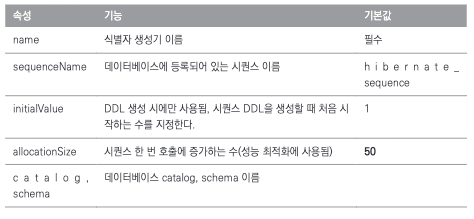
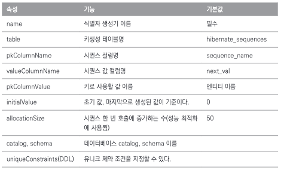

# Chapter 4. 엔티티 매핑

JPA는 다양한 매핑 어노테이션을 지원하는데 크게 4가지로 분류할 수 있다.

- 객체와 테이블 매핑 : `@Entity`, `@Table`
- 기본 키 매핑 : `@Id`
- 필드와 컬럼 매핑 : `@Column`
- 연관관계 매핑 : `@ManyToOne`, `@JoinColumn`

## @Entity

JPA를 사용해서 테이블과 매핑할 클래스는 `@Entity` 어노테이션을 필수로 붙여야 한다.

@Entity가 붙은 클래스는 JPA가 관리하는 것으로, 엔티티라고 부른다.

> @Entity 적용 시 주의 사항
> 
> - 기본 생성자는 필수다. (파라미터가 없는 public 또는 protected 생성자)
> - final 클래스, enum, interface, inner 클래스에는 사용할 수 없다.
> - 저장할 필드에 final을 사용하면 안된다.

```java
public Member() {} // 기본 생성자
```

문제는 다음과 같이 생성자를 하나 이상 만들면 자바는 기본 생성자를 자동으로 만들지 않는다. 이때는 기본 생성자를 직접 추가해야 한다.

```java
public Member() {} // 직접 만든 기본 생성자

// 임의의 생성자
public Member(String name) {
    this.name = name;
}
```

## @Table

@Table은 엔티티와 매핑할 테이블을 지정한다. 생략하면 매핑한 엔티티 이름을 테이블 이름으로 사용한다.

```java
@Entity
@Table(name="MEMBER")
public class Member {
    ...
}
```

## 다양한 매핑 사용

다음과 같은 요구사항이 있다고 가정해보자.

1. 회원은 일반 회원과 관리자로 구분해야 한다.
2. 회원 가입일과 수정일이 있어야 한다.
3. 회원을 설명할 수 있는 필드가 있어야 한다. 이 필드는 길이 제한이 없다.

위 요구사항을 만족하도록 회원 엔티티에 기능을 추가해보자.

```java
package com.book.entity;

import com.book.type.RoleType;
import jakarta.persistence.Column;
import jakarta.persistence.Entity;
import jakarta.persistence.EnumType;
import jakarta.persistence.Enumerated;
import jakarta.persistence.Id;
import jakarta.persistence.Lob;
import jakarta.persistence.Table;
import jakarta.persistence.Temporal;
import jakarta.persistence.TemporalType;
import java.util.Date;
import lombok.Getter;
import lombok.Setter;

@Setter
@Getter
@Entity
@Table(name = "MEMBER")
public class Member {
    @Id
    @Column(name = "ID")
    private String id;
    @Column(name = "NAME")
    private String username;

    private Integer age;

    // == 추가 ==
    @Enumerated(EnumType.STRING)
    private RoleType roleType;

    @Temporal(TemporalType.TIMESTAMP)
    private Date createdDate;

    @Temporal(TemporalType.TIMESTAMP)
    private Date lastModifiedDate;

    @Lob
    private String description;
}
```

위 코드를 분석해보자.

1. `roleType`: 자바의 enum을 사용해서 회원의 타입을 구분. `@Enumerated` 어노테이션을 사용해서 매핑한다.
2. `createdDate`, `lastModifiedDate`: 자바의 `Date` 타입을 사용해서 회원의 가입일과 수정일을 구분. `@Temporal` 어노테이션을 사용해서 매핑한다.
3. `description`: 회원을 설명할 수 있는 필드. 길이 제한이 없다고 했으므로 VARCHAR 타입 대신 CLOB 타입을 사용한다. `@Lob` 어노테이션을 사용해서 매핑한다.

## 데이터베이스 스키마 자동 생성

JPA는 데이터베이스 스키마를 자동으로 생성하는 기능을 지원한다. 클래스의 매핑정보를 보면 어떤 테이블에 어떤 컬럼을 사용하는지 알 수 있다.
JPA는 이 매핑정보와 데이터베이스 방언을 사용해서 데이터베이스 스키마를 생성한다.

```yml
spring:
  datasource:
    driver-class-name: com.mysql.cj.jdbc.Driver
    url: jdbc:mysql://localhost:3306/jpa?createDatabaseIfNotExist=true&useSSL=false&serverTimezone=Asia/Seoul&allowPublicKeyRetrieval=true
    username: root
    password: 1234
  jpa:
    database: mysql
    hibernate:
      ddl-auto: create # 애플리케이션 실행 시점에 테이블을 drop하고 다시 생성한다.
    properties:
      hibernate:
        format_sql: true
        show_sql: true # 콘솔에 SQL을 출력한다.
        dialect: org.hibernate.dialect.MySQLDialect # 데이터베이스 방언
        use_sql_comments: true
    defer-datasource-initialization: true
```

위 설정을 추가하고 애플리케이션을 실행하면 다음과 같은 SQL이 콘솔에 출력된다.

```sql
Hibernate: 
    drop table if exists member
Hibernate: 
    create table member (
        age integer,
        created_date datetime(6),
        last_modified_date datetime(6),
        id varchar(255) not null,
        name varchar(255),
        role_type enum ('ADMIN','USER'),
        description tinytext,
        primary key (id)
    ) engine=InnoDB
```

## DDL 생성 기능

회원 이름은 필수로 입력되어야 하고, 10자를 초과하면 안된다는 제약조건이 추가되었다.

스키마 자동 생성을 통해 만들어지는 DDL에 이 제약조건을 추가해보자.

```java
@Setter
@Getter
@Entity
@Table(name = "MEMBER")
public class Member {
    @Id
    @Column(name = "ID")
    private String id;
    
    @Column(name = "NAME", nullable = false, length = 10) // 추가
    private String username;
    
    // ...
}
```

@Column 매핑정보를 보면 `nullable = false`와 `length = 10`이 추가되었다. 이 정보를 보고 JPA는 DDL을 수정해서 테이블을 다시 생성한다.

```sql
Hibernate: 
    drop table if exists member
Hibernate: 
    create table member (
        age integer,
        created_date datetime(6),
        last_modified_date datetime(6),
        name varchar(10) not null, # 추가
        id varchar(255) not null,
        role_type enum ('ADMIN','USER'),
        description tinytext,
        primary key (id)
    ) engine=InnoDB
```

이번에는 유니크 제약조건을 만들어주는 @Table의 uniqueConstraints 속성을 사용해보자.

```java
@Setter
@Getter
@Entity
@Table(name = "MEMBER", uniqueConstraints = { // 추가
  @UniqueConstraint(
    name = "NAME_AGE_UNIQUE",
    columnNames = {"NAME", "AGE"}
  )
})
public class Member {
    @Id
    @Column(name = "ID")
    private String id;

    @Column(name = "NAME", nullable = false, length = 10) // 추가
    private String username;

    private Integer age;
    
    // ...
```

위 코드를 보면 `uniqueConstraints` 속성을 사용해서 유니크 제약조건을 추가했다. 이 정보를 보고 JPA는 DDL을 수정해서 테이블을 다시 생성한다.

```sql
Hibernate: 
    alter table member 
       add constraint NAME_AGE_UNIQUE unique (name, age)
```

## 기본 키 매핑

지금까진 앞선 예제처럼 `@Id` 어노테이션을 사용해서 기본 키를 직접 할당했다. 이번에는 자동으로 생성되는 기본 키를 매핑해보자.

- 직접 할당 : 기본키를 애플리케이션에서 직접 할당한다.
- 자동 생성 : 대리 키 사용 방식
  - `IDENTITY`: 기본 키 생성을 데이터베이스에 위임한다.
  - `SEQUENCE`: 데이터베이스 시퀀스를 사용해서 기본 키를 할당한다.
  - `TABLE`: 키 생성 테이블을 사용한다.

### 기본 키 직접 할당 전략

```java
@Id
@Column(name = "id")
private String id;
```

@Id 적용 가능한 자바 타입은 다음과 같다.

- 자바 기본형
- 자바 래퍼 클래스
- String
- java.util.Date
- java.sql.Date
- java.math.BigDecimal
- java.math.BigInteger

기본 키 직접 할당 전략은 em.persist()를 호출하기 전에 애플리케이션에서 기본 키를 직접 할당하는 방식이다.

```java
Member member = new Member();
member.setId("id1"); // 직접 할당
member.setUsername("A");
em.persist(member);
```

### IDENTITY 전략

IDENTITY 전략은 기본 키 생성을 데이터베이스에 위임하는 방식이다. 주로 MySQL, PostgreSQL, SQL Server, DB2에서 사용한다.
AUTO_INCREMENT로 지정이 되어있다면 데이터베이스가 알아서 기본 키를 생성해준다.

```java
@Id
@GeneratedValue(strategy = GenerationType.IDENTITY) // IDENTITY 전략
private Long id;
```

```java
private static void logic(EntityManaget em) {
    Board board = new Board();
    em.persist(board);
    System.out.println("board.id = " + board.getId());
}
// board.id = 1
```

> IDENTITY 전략은 데이터베이스에 엔티티를 저장해야 기본 키를 구할 수 있으므로, 엔티티를 저장하는 즉시 INSERT SQL을 실행하고 DB에서 식별자를 조회한다.
> 따라서 이 전략은 트랜잭션을 지원하는 쓰기 지연이 동작하지 않는다.

### SEQUENCE 전략

데이터베이스 시퀀스는 유일한 값을 순서대로 생성하는 특별한 데이터베이스 오브젝트다. 오라클, PostgreSQL, DB2, H2 데이터베이스에서 사용할 수 있다.

```sql
CREATE TABLE BOARD (
    ID BIGINT NOUT NULL PRIMARY KEY,
    DATA VARCHAR(255)
);

// 시퀀스 생성
CRAETE SEQUENCE BOARD_SEQ START WITH 1 INCREMENT BY 1;
```

시퀀스를 생성하고 엔티티에 매핑해보자.

```java
@Entity
@SequenceGenerator(
    name = "BOARD_SEQ_GENERATOR",
    sequenceName = "BOARD_SEQ", // 매핑할 데이터베이스 시퀀스 이름
    initialValue = 1, allocationSize = 1 // allocationSize의 기본값은 50
)
public class Board {
    
    @Id
    @GeneratedValue(strategy = GenerationType.SEQUENCE, generator = "BOARD_SEQ_GENERATOR")
    private Long id;
    
    // ...
}
```



시퀀스 사용 코드는 IDENTITY 전략과 동일하지만 내부 동작 방식이 다르다.

- `IDENTITY 전략`: 먼저 엔티티를 데이터베이스에 저장한 후에 식별자를 조회해서 엔티티의 식별자에 할당한다.
- `SEQUENCE 전략`: 데이터베이스 시퀀스를 사용해서 식별자를 조회한 후에 엔티티에 할당한다.

### TABLE 전략

TABLE 전략은 키 생성 전용 테이블을 하나 만들어서 데이터베이스 시퀀스를 흉내내는 전략이다. (시퀀스 전략과 내부 동작 방식이 같음)

모든 데이터베이스에 적용할 수 있다.

```sql
# TABLE 전략을 사용할 테이블 생성
CREATE TABLE MY_SEQUENCES (
    sequence_name VARCHAR(255) NOT NULL,
    next_val BIGINT,
    PRIMARY KEY (sequence_name)
);
```

```java
// 엔티티에 매핑
@Entity
@TableGenerator(
    name = "BOARD_SEQ_GENERATOR",
    table = "MY_SEQUENCES", // 매핑할 데이터베이스 시퀀스 이름
    pkColumnValue = "BOARD_SEQ", allocationSize = 1
)
public class Board {
    
    @Id
    @GeneratedValue(strategy = GenerationType.TABLE, generator = "BOARD_SEQ_GENERATOR")
    private Long id;
    
    // ...
}
```



### AUTO 전략

`GenerationType.AUTO`는 선택한 데이터베이스 방언에 따라 IDENTITY, SEQUENCE, TABLE 전략 중 하나를 자동으로 선택한다.

예를 들어 오라클을 선택하면 시퀀스를 사용하고, MySQL을 선택하면 AUTO_INCREMENT를 사용한다.

### 기본 키 매핑 정리

- 직접 할당 : em.persist()를 호출하기 전에 애플리케이션에서 직접 식별자 값을 할당. 만약 식별자 값이 없으면 예외 발생
- SEQUENCE : 데이터베이스 시퀀스를 사용해서 식별자 값을 획득한 후 영속성 컨텍스트에 저장
- IDENTITY : 데이터베이스에 엔티티를 저장해서 식별자 값을 획득한 후 영속성 컨텍스트에 저장
- TABLE : 데이터베이스 시퀀스 생성용 테이블에서 값을 획득한 후 영속성 컨텍스트에 저장
