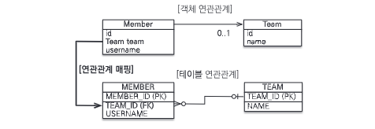
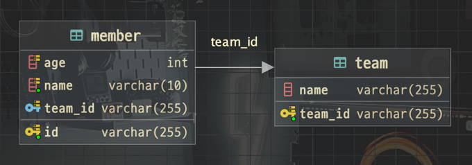
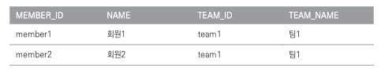
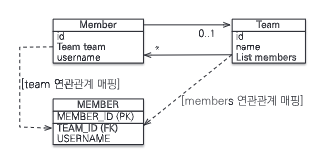
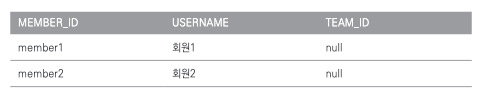

# Chapter 5. 연관관계 매핑 기초

> 객체(참조), 테이블(외래 키)를 매핑해보자

- 방향 : 단방향, 양방향
- 다중성 : 다대일, 일대다, 일대일, 다대다
- 연관관계의 주인 : 객체 양방향 연관관계는 관리 주인이 필요하다.

## 단방향 연관관계

참조를 통한 연관관계는 언제나 단방향이다. 객체간에 연관관계를 양방향으로 만들고 싶으면 반대쪽에도 필드를 추가해서 참조를 보관해야 한다.
결국 연관관계를 하나 더 만들어야 하는 것이다. 반면에 테이블은 외래 키 하나로 양방향으로 조인할 수 있다.

### 객체 관계 매핑



```java

@Entity
public class Member {

    @Id
    @Column(name = "ID")
    private String id;

    @Column(name = "NAME", nullable = false, length = 10)
    private String username;

    // 연관관계 매핑
    @ManyToOne // 다대일
    @JoinColumn(name = "TEAM_ID") // 외래 키 매핑 어노테이션
    private Team team;
}
```

```java

@Entity
@Table(name = "TEAM")
public class Team {

    @Id
    @Column(name = "TEAM_ID")
    private String id;
    private String name;
}
```



## 연관관계 사용

### 저장

```java
public void testSave() {

    //팀1 저장
    Team team1 = new Team("team1", "팀1");
    em.persist(team1);

    //회원1 저장
    Member member1 = new Member(100L, "회원1");
    member1.setTeam(team1);     //연관관계 설정 member1 -> team1
    em.persist(member1);

    //회원2 저장
    Member member2 = new Member(101L, "회원2");
    member2.setTeam(team1);     //연관관계 설정 member2 -> team1
    em.persist(member2);
}
```

> 주의 : JPA에서 엔티티를 저장할 때 연관된 모든 엔티티는 영속 상태여야 한다. 즉, 팀 엔티티를 먼저 영속화하고 회원 엔티티를 영속화해야 한다.

위 코드의 중요한 부분을 분석해보자.

```java
member1.setTeam(team1); // 회원 -> 팀 참조
em.persist(member1); // 저장
```

회원 엔티티는 팀 엔티티를 참조하고 저장한다. JPA는 참조한 팀의 식별자(Team.id)를 외래 키로 사용해서 적절한 쿼리를 생성한다.



### 조회

연관관계가 있는 엔티티를 조회하는 방법은 크게 2가지다.

1. 객체 그래프 탐색(객체 연관관계를 사용한 조회)
   ```java
    Member member = em.find(Member.class, 100L);
    Team team = member.getTeam();
    System.out.println("팀 이름 = " + team.getName()); //팀 이름 = 팀1
   ```
2. 객체지향 쿼리 사용(JPQL)
    ```java
    private static void queryLogicJoin(EntityManager em) {
    
        String jpql = "select m from Member m join m.team t where " + "t.name=:teamName";
    
        List<Member> resultList = em.createQuery(jpql, Member.class)
                                    .setParameter("teamName", "팀1")
                                    .getResultList();
    
        for (Member member : resultList) {
            System.out.println("[query] member.username=" + member.getUsername());
        }
    }
    
    // 결과 : [query] member.username=회원1
    // 결과 : [query] member.username=회원2
    ```

### 수정

팀1 소속이던 회원을 팀2에 소속되도록 수정해보자.

```java
priavte

static void updateRelation(EntityManager em) {

    // 새로운 팀2
    Team team2 = new Team("team2", "팀2");
    em.persist(team2);

    // 회원1에 새로운 팀2 설정
    Member member = em.find(Member.class, "member1");
    member.setTeam(team2);
}
```

```sql
UPDATE member
SET team_id='team2' # ...
WHERE id = 'member1';
```

앞에 3장에서 이야기했듯이 수정은 em.update() 같은 메서드가 없다. 단순히 불러온 엔티티의 값만 변경해두면 틀내잭션을 커밋할 때 플러시가 일어나면서 변경 감지 기능이 작동한다.

### 연관관계 제거

회원1을 팀에 소속하지 않도록 변경하려면 어떻게 해야할까?

```java
private static void deleteRelation(EntityManager em) {

    Member member1 = em.find(Member.class, "member1");
    member1.setTeam(null); // 연관관계 제거
}
```

```sql
UPDATE member
SET team_id=null # ...
WHERE id = 'member1';
```

### 연관된 엔티티 삭제

연관된 엔티티를 삭제하려면 기존에 있던 연관관계를 먼저 제거하고삭제해야 한다. 그렇지 않으면 외래 키 제약조건으로 인해, 데이터베이스에서 오류가 발생한다.

```java
member1.setTeam(null); // 회원1 연관관계 제거
member2.setTeam(null); // 회원2 연관관계 제거
em.remove(team); // 팀 삭제
```

## 양방향 연관관계

지금까지 회원에서 팀으로만 접근하는 다대일 단방향 매핑을 알아보았다. 이번에는 반대 방향인 팀에서 회원으로 접근하는 관계를 추가해보자. (양방향)

### 양방향 연관관계 매핑

```java
@Entity
@Table(name = "TEAM")
public class Team {

    @Id
    @Column(name = "TEAM_ID")
    private String id;
    private String name;

    // == 추가 ==
    @OneToMany(mappedBy = "team") // mappedBy = 연관관계의 주인 필드명(주로 역방향)
    private List<Member> members = new ArrayList<>();
}
```

이렇게 반대편인 팀에 컬렉션을 추가하고 mappedBy 속성에 연관관계의 주인인 team 필드를 입력한다. 이렇게 하면 양방향 연관관계가 완성된다.

## 연관관계의 주인

위에서 알아본 `mappedBy`에 대해 알아보자.

### 양방향 매핑의 규칙: 연관관계의 주인

양방향 연관관계 매핑 시 지켜야 할 규칙이 있는데 **두 연관관계 중 하나를 연관관계의 주인으로 정해야 한다.** (= 외래 키 관리자 선택)

> 연관관계의 주인만이 데이터베이스 연관관계와 매핑되고 외래 키를 관리할 수 있다. 반면에 주인이 아닌 쪽은 읽기만 할 수 있다.

- 주인은 mappedBy 속성을 사용하지 않는다.
- 주인이 아니면 mappedBy 속성을 사용해서 속성의 값으로 연관관계의 주인을 지정해야 한다.

그렇다면 `Member.team`, `Team.members` 중 어느 것을 연관관계의 주인으로 정해야 할까?



### 연관관계의 주인은 외래 키가 있는 곳

연관관계의 주인은 외래 키가 있는 곳으로 정해야 한다. 여기서는 Member.team이 연관관계의 주인이다.

주인이 아닌 Team.members에는 mappedBy="team"으로 주인이 아님을 설정해야 한다. (여기서 team은 연관관계의 주인인 Member엔티티의 team필드를 말한다.)

> 참고로 데이터베이스 테이블의 다대일, 일대다 관계에서는 항상 '다' 쪽이 외래 키를 가진다. '다' 쪽인 @ManyToOne은 항상 연관관계의 주인이 되므로 mappedBy를 설정할 수 없다.
> 따라서 @ManyToOne은 mappedBy 속성이 없다.

### 양방향 연관관계의 주의점

양방향 연관관계를 설정하고 가장 흔히 하는 실수는 `연관관계의 주인에는 값을 입력하지 않고, 주인이 아닌 곳에만 값을 입력하는 것`이다.

```java
public void testSaveNonOwner() {
    
    // 회원1 저장
    Member member1 = new Member("member1", "회원1");
    em.persist(member1);
     
    // 회원2 저장
    Member member2 = new Member("member2", "회원2");
    em.persist(member1);
    
    Team team1 = new Team("team1", "팀1");
    // 주인이 아닌 곳만 연관관계 설정
    team1.getMembers().add(member1);
    team1.getMembers().add(member2);
    
    em.persist(team1);
}
```



## 정리

- 단방향 매핑만으로도 테이블과 객체의 연관관계 매핑은 이미 완료된 것이다.
- 단방향을 양방향으로 만들면 반대 방향으로 객체 그래프 탐색 기능이 추가되는 장점이 있다.
- 양방향 연관관계를 매핑하려면 객체에서 양쪽 방향을 모두 관리해야 한다.