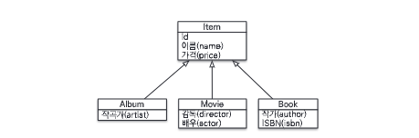
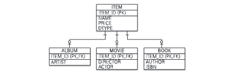
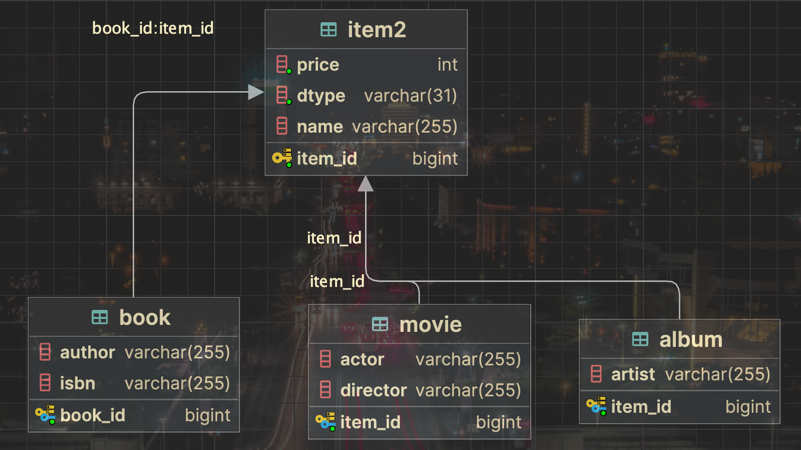
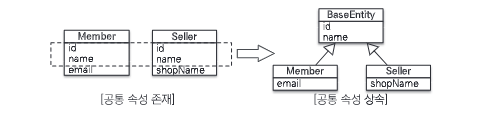
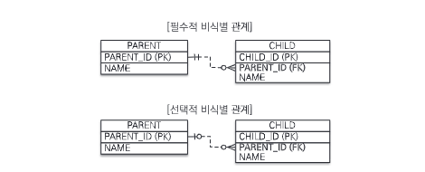

# Chapter 7. 고급 매핑

이 장에서 다룰 고급 매핑

- `상속 관계 매핑` : 객체의 상속 관계를 데이터베이스에 어떻게 매핑하는지
- `@MappedSuperclass` : 등록일, 수정일 같이 여러 엔티티에서 공통으로 사용하는 매핑 정보만 상속받고 싶을 때 사용
- `복합 키와 식별 관계 매핑` : 데이터베이스의 식별자가 하나 이상일 때 매핑하는 방법
- `조인 테이블` : 테이블은 외래 키 하나로 연관관계를 맺을 수 있지만 연관관계를 관리하는 연결 테이블을 두는 방법도 있다.
- `엔티티 하나에 여러 테이블 매핑` : 보통 엔티티 하나에 테이블 하나를 매핑하지만 엔티티 하나에 여러 테이블을 매핑하는 방법도 있다.

## 상속 관계 매핑

관계형 데이터베이스에는 객체지향에서 다루는 상속이라는 개념이 없다. 대신 `서브타입 관계`라는 모델링 기법이 가장 유사하다.




슈퍼타입 서브타입 논리 모델을 실제 물리 모델인 테이블로 구현할 때는 3가지 방법이 있다.

1. 각각 테이블로 변환 : 조인 전략
2. 통합 테이블로 변환 : 단일 테이블 전략
3. 서브타입 테이블로 변환 : 구현 클래스마다 테이블 전략

### 조인 전략



엔티티 각각을 모두 테이블로 만들고 자식 테이블이 부모 테이블의 기본 키를 받아서 기본 키 + 외래 키로 사용하는 전략이다.
이 전략을 사용할 때 주의점이 있는데 **객체는 타입으로 구분할 수 있지만 테이블은 타입의 개념이 없다. 따라서 타입을 구분하는 컬럼을 추가해야한다.**

```java
@Entity
@Inheritance(strategy = InheritanceType.JOINED)
@DiscriminatorColumn(name = "DTYPE")
public abstract class Item2 {

    @Id
    @GeneratedValue
    @Column(name = "ITEM_ID")
    private Long id;

    private String name;
    private int price;
}
```

```java
@Entity
@DiscriminatorValue("A")
public class Album extends Item2 {

    private String artist;
}
```

```java
@Entity
@DiscriminatorValue("M")
public class Movie extends Item2 {

    private String director;
    private String actor;
}
```

위의 매핑 정보를 분석해보자.

1. `@Inheritance(strategy = InheritanceType.JOINED)` : 상속 매핑은 부모 클래스에 `@Inheritance`를 사용해야 한다. 그리고 매핑 전략을 지정해야 하는데 여기서는 조인 전략을 사용했다.
2. `@DiscriminatorColumn(name = "DTYPE")` : 부모 클래스에 구분 컬럼을 지정한다. 이 컬럼으로 저장된 자식 테이블을 구분할 수 있다. 기본값은 `DTYPE`이다.
3. `@DiscriminatorValue("M")` : 엔티티를 저장할 때 구분 컬럼에 입력할 값을 지정한다. 이 값으로 엔티티를 구분할 수 있다.

자식 테이블은 부모 테이블의 ID컬럼명을 그대로 사용하는데, 만약 변경하고 싶다면 `@PrimaryKeyJoinColumn`을 사용하면 된다.

```java
@Entity
@DiscriminatorValue("B")
@PrimaryKeyJoinColumn(name = "BOOK_ID") // ID 재정의
public class Book extends Item2 {

    private String author;
    private String isbn;
}
```


#### 조인 전략 정리

- 장점
  - 테이블이 정규화된다.
  - 외래 키 참조 무결성 제약조건을 활용할 수 있다.
  - 저장공간을 효율적으로 사용한다.
- 단점
  - 조회할 때 조인이 많이 사용되므로 성능 저하가 될 수 있다.
  - 조회 쿼리가 복잡하다.
  - 데이터를 등록할 INSERT SQL을 두 번 실행한다. (why? 부모 테이블에 먼저 INSERT를 하고 자식 테이블에 INSERT를 한다.)

### 단일 테이블 전략


이름 그대로 테이블을 하나만 사용하는 전략이다. 그리고 구분 컬럼(DTYPE)으로 어떤 자식 데이터가 저장되었는지 구분한다. 조회할 때 조인을 사용하지 않아서 일반적으로 가장 빠르다.
이 전략의 주의점으로는 **자식 엔티티가 매핑한 컬럼은 모두 null을 허용해야 한다는 점이다.**

```java
@Entity
@Inheritance(strategy = InheritanceType.SINGLE_TABLE) // 이 부분만 변경
@DiscriminatorColumn(name = "DTYPE")
public abstract class Item2 {

    @Id
    @GeneratedValue
    @Column(name = "ITEM_ID")
    private Long id;

    private String name;
    private int price;
}
```


#### 단일 테이블 전략 정리

- 장점
  - 조회 성능이 빠르다.
  - 조회 쿼리가 단순하다.
- 단점
  - 자식 엔티티가 매핑한 컬럼은 모두 null을 허용해야 한다.
  - 단일 테이블에 모든 것을 저장하므로 테이블이 커질 수 있다. 상황에 따라서 조회 성능이 오히려 느려질 수 있다.
- 특징
  - 구분 컬럼을 꼭 사용해야 한다. `@DiscriminatorColumn`을 꼭 사용해야 한다.
  - `@DiscriminatorValue`를 지정하지 않으면 기본으로 엔티티 이름을 사용한다. (예시 - Movie, Album, Book)

### 구현 클래스마다 테이블 전략


위 그림과 같이 자식 엔티티마다 테이블을 만든다. 그리고 자식 테이블 각각에 필요한 컬럼이 모두 있다.

하지만 일반적으로 추천하지 않는 방법이므로 생략하겠다.

## @MappedSuperclass

부모 클래스는 테이블과 매핑하지 않고 부모 클래스를 상속받는 자식 클래스에게 매핑 정보만 제공하고 싶으면 `@MappedSuperclass`를 사용한다.
비유를 하자면 **추상 클래스**와 비슷하다.



```java
@MappedSuperclass
public abstract class BaseEntity {

    @Id
    @GeneratedValue
    private Long id;
    private String name;
}
```
```java
@Entity
@AttributeOverride(name = "id", column = @Column(name = "member_id")) // 재정의
public class Member extends BaseEntity {

    // ID, name 상속
    private String email;

}
```
```java
@Entity
@AttributeOverride(name = "id", column = @Column(name = "seller_id")) // 재정의
public class Seller extends BaseEntity {

    // ID, name 상속
    private String shopName;

}
```

## 복합 키와 식별 관계 매핑

### 식별 관계 vs 비식별 관계

데이터베이스 테이블 사이에 관계는 **외래 키가 기본키에 포함되는지 여부**에 따라 `식별 관계`와 `비식별 관계`로 나뉜다.

> **식별 관계** 
> 
> 식별 관계는 부모 테이블의 기본 키를 내려받아서 자식 테이블의 기본 키 + 외래 키로 사용하는 관계
>
> 

> **비식별 관계**
>
> 비식별 관계는 부모 테이블의 기본 키를 받아서 자식 테이블의 외래 키로만 사용하는 관계
>
> 

- 필수적 비식별 관계(Mandatory) : 외래 키에 null을 허용하지 않는다. 연관관계를 필수적으로 맺어야 한다.
- 선택적 비식별 관계(Optional) : 외래 키에 null을 허용한다. 연관관계를 맺을지 말지 선택할 수 있다.

### 복합 키: 비식별 관계 매핑

JPA는 영속성 컨텍스트에 엔티티를 보관할 때 엔티티의 식별자를 키로 사용한다. 그리고 식별자를 구분하기 위해 `equals()`와 `hashCode()`를 사용해서 동등성 비교를 한다.
JPA는 복합 키를 지원하기 위해 `@IdClass`와 `@EmbeddedId`를 제공하는데 `@IdClass`는 관계형 데이터베이스에 가까운 방법이고 `@EmbeddedId`는 객체지향에 가까운 방법이다.

#### @IdClass


```java
@Entity
@IdClass(ParentId.class)
public class Parent {

    @Id
    @Column(name = "PARENT_ID1")
    private Long id1; // ParentId.id1과 연결

    @Id
    @Column(name = "PARENT_ID2")
    private Long id2; // ParentId.id2와 연결

    private String name;
}

```
```java
public class ParentId implements Serializable { // Serializable 구현

    private Long id1; // Parent.id1과 연결
    private Long id2; // Parent.id2와 연결

    public ParentId() { // 기본 생성자
    }

    public ParentId(Long id1, Long id2) {
        this.id1 = id1;
        this.id2 = id2;
    }

    // equals, hashCode 구현
    @Override
    public boolean equals(Object o) {
        if (this == o) {
            return true;
        }
        if (o == null || getClass() != o.getClass()) {
            return false;
        }
        ParentId parentId = (ParentId) o;
        return Objects.equals(id1, parentId.id1) && Objects.equals(id2, parentId.id2);
    }

    @Override
    public int hashCode() {
        return Objects.hash(id1, id2);
    }
}
```
```java
@Entity
public class Child {

    @Id
    private Long id;

    @ManyToOne
    @JoinColumns({
      @JoinColumn(name = "PARENT_ID1", referencedColumnName = "PARENT_ID1"),
      @JoinColumn(name = "PARENT_ID2", referencedColumnName = "PARENT_ID2")
    })
    private Parent parent;
}

```

#### @EmbeddedId

@IdClass가 데이터베이스에 맞춘 방법이라면 @EmbeddedId는 객체지향적인 방법이다.

```java
@Entity
public class Parent {
    
    @EmbeddedId // 식별자 클래스를 직접 사용하고, @EmbeddedId를 사용해서 매핑
    private ParentId id;
    private String name;
}
```

```java
@Embeddable
public class ParentId implements Serializable { // Serializable 구현

    @Column(name = "PARENT_ID1")
    private Long id1;
    @Column(name = "PARENT_ID2")
    private Long id2;

    public ParentId() { // 기본 생성자
    }

    public ParentId(Long id1, Long id2) {
        this.id1 = id1;
        this.id2 = id2;
    }
    
    // equals, hashCode 구현
}
```

@IdClass와는 다르게 @EmbeddedId를 적용한 식별자 클래스는 식별자 클래스에 기본키를 직접 매핑한다.

식별자 클래스는 다음 조건을 만족해야 한다.

- @Embeddable 어노테이션을 붙여야 한다.
- Serializable 인터페이스를 구현해야 한다.
- equals, hashCode를 구현해야 한다.
- 기본 생성자가 있어야 한다.
- 식별자 클래스는 public이어야 한다.

## 조인 테이블

연결 테이블이라고도 한다. 연결 테이블은 주로 다대다 관계를 일대다, 다대일 관계로 풀어내기 위해 사용한다.

```java
// 부모
@Entity
public class Parent {

    @Id
    @GeneratedValue
    @Column(name = "PARENT_ID")
    private Long id;
    private String name;

    @ManyToMany
    @JoinTable(name = "PARANET_CHILD",
        joinColumns = @JoinColumn(name = "PARENT_ID"),
        inverseJoinColumns = @JoinColumn(name = "CHILD_ID")
    )
    private List<Child> child = new ArrayList<>();
}
```

```java
// 자식
@Entity
public class Child {

    @Id
    @GeneratedValue
    @Column(name = "CHILD_ID")
    private Long id;
    private String name;

    @ManyToMany(mappedBy = "child") // 양방향 매핑
    private List<Parent> parents = new ArrayList<>();
}
```