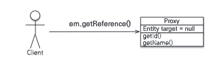
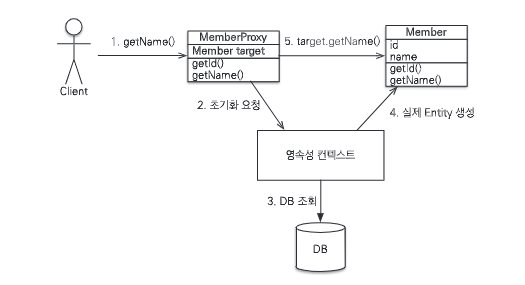
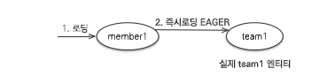
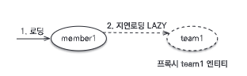
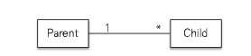
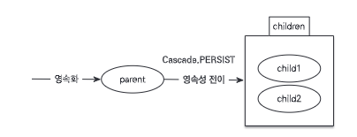

# Chapter 8. 프록시와 연관관계 관리

이 장에서 다룰 내용

- 프록시와 즉시로딩, 지연로딩
  ```markdown
  객체는 객체 그래프로 연관된 객체들을 탐색한다. 그런데 객체가 데이터베이스에 저장되어 있으므로 연관된 객체를 마음껏 탐색하기는 어렵다.
  JPA 구현체들은 이 문제를 해결하려고 `프록시`라는 기술을 사용한다. 프록시를 사용하면 연관된 객체를 처음부터 데이터베이스에서 조회하는 것이 아니라,
  실제 사용하는 시점에 데이터베이스에서 조회할 수 있다. 하지만 자주 함께 사용하는 개체들은 조인을 사용해서 함께 조회하는 것이 효과적이다.
  JPA는 `즉시로딩`과 `지연로딩`이라는 방법으로 둘을 모두 지원한다.
  ```
- 영속성 전이와 고아 객체
  ```markdown
  JPA는 연관된 객체를 함께 저장하거나 함께 삭제할 수 있는 `영속성 전이`와 `고아 객체 제거`라는 편리한 기능을 제공한다.
  ```

## 프록시

지연 로딩 기능을 사용하려면 실제 엔티티 객체 대신에 데이터베이스 조회를 지연할 수 있는 가짜 객체가 필요한데 이것을 `프록시 객체`라고 한다.

### 프록시 기초

JPA에서 식별자로 엔티티 하나를 조회할 때는 `EntityManager.find()` 메소드를 사용한다.
이 메서드는 영속성 컨텍스트에 엔티티가 없으면 데이터베이스를 조회한다.

```java
Member member = em.find(Member.class, "member1");
```

이렇게 엔티티를 직접 조회하면 조회한 엔티티를 실제 사용하든 안하든 데이터베이스를 조회하게 된다.
엔티티를 실제 사용하는 시점까지 데이터베이스 조회를 미루고 싶으면 `EntityManager.gerReference()` 메소드를 사용하면 된다.

```java
Member member = em.getReference(Member.class, "member1");
```

이 메서드는 데이터베이스를 조회하지 않고 실제 엔티티 객체도 생성하지 않는다. 대신에 데이터베이스 접근을 위임한 프록시 객체를 반환한다.



```java
// 프록시 초기화 예제
Member member = em.getReference(Member.class, "member1");
member.getName(); // 프록시 초기화
```



member를 참조하고 있다가 getName()을 호출하면 프록시 객체가 초기화되면서 실제 엔티티 객체를 조회한다.

### 프록시 특징

- 프록시 객체는 처음 사용할 때 한 번만 초기화된다.
- 프록시 객체를 초기화한다고 프록시 객체가 실제 엔티티로 바뀌는 것은 아니다. 프록시 객체가 초기화되면 프록시 객체를 통해서 실제 엔티티에 접근할 수 있다.
- 프록시 객체는 원본 엔티티를 상속받은 객체이므로 타입 체크 시에 주의해서 사용해야 한다.
- 영속성 컨텍스트에 찾는 엔티티가 이미 있으면 데이터베이스를 조회할 필요가 없으므로 em.getReference()를 호출해도 프록시가 아닌 실제 엔티티를 반환한다.
- 영속성 컨텍스트의 도움을 받을 수 없는 준영속 상태일 때, 프록시를 초기화하면 문제가 발생한다.

### 프록시와 식별자

```java
Team team = em.getReference(Team.class, "team1"); // 식별자 보관
team.getId(); // 초기화되지 않음
```

프록시 객체는 식별자 값을 가지고 있으므로 식별자 값을 조회하는 `team.getId()`를 호출해도 초기화되지 않는다.
단, 엔티티 접근 방식을 프로퍼티(@Access(AccessType.PROPERTY))로 설정한 경우에만 초기화하지 않는다.

만약 엔티티 접근 방식을 필드(@Access(AccessType.FIELD))로 설정하면 JPA는 `getId()` 메서드가 id만 조회하는 메서드인지 다른 필드까지 활용해서 어떤 일을
하는 메서드인지 알지 못하므로 프록시 객체를 초기화한다.

따라서 `PROPERTY` 접근 방식을 사용하면 다음과 같은 장점이 있다.

```java
Member member = em.find(Member.class, "member1");
Team team = em.getReference(Team.class, "team1"); // SQL 실행 X
member.setTeam(team);
```

연관관계를 설정할 때는 식별자 값만 사용하므로 프록시를 사용하면 데이터베이스 접근 횟수를 줄일 수 있다.

### 프록시 확인

```java
boolean isLoad = em.getEntityManagerFactory()
                    .getPersistenceUnitUtil().isLoaded(team);
// 또는 boolean isLoad = emf.getPersistenceUnitUtil().isLoaded(team);

System.out.println("isLoad = " + isLoad); // 초기화 여부 확인
```

JPA가 제공하는 `PersistenceUnitUtil.isLoaded(Object entity)`을 사용하면 프록시 인스턴스의 초기화 여부를 확인할 수 있다.

- 초기화되지 않은 프록시 인스턴스 : false
- 초기화된 프록시 인스턴스 : true

## 즉시 로딩과 지연 로딩

> 프록시 객체는 주로 연관된 엔티티를 지연 로딩할 때 사용한다.

member가 team에 소속되어 있고, team은 여러 member를 가질 수 있다고 가정하자.

```java
Member member = em.find(Member.class, "member1");
Team team = member.getTeam(); // 객체 그래프 탐색
System.out.println("team = " + team.getName()); // 팀 엔티티 사용
```

회원 엔티티를 조회할 때 연관된 팀 엔티티도 함께 데이터베이스에서 조회하는 것이 좋을까? 

아니면 회원 엔티티만 조회해 두고 팀 엔티티는 실제 사용하는 시점에 데이터베이스에서 조회하는 것이 좋을까?

JPA는 이 둘을 모두 지원한다. 연관된 엔티티를 데이터베이스에서 함께 조회하려면 `즉시 로딩`을 사용하면 되고, 연관된 엔티티를 실제 사용하는 시점에 데이터베이스에서 조회하려면 `지연 로딩`을 사용하면 된다.

- **즉시 로딩** : 엔티티를 조회할 때 연관된 엔티티도 함께 조회한다.
  - em.find(Member.class, "member1") 를 호출하면 회원 엔티티와 연관된 팀 엔티티도 함께 조회한다. 
  - `@ManyToOne(fetch = FetchType.EAGER)`
- **지연 로딩** : 연관된 엔티티를 실제 사용할 때 조회한다.
  - member.getTeam().getName() 처럼 조회한 팀 엔티티를 실제 사용하는 시점에 JPA가 SQL을 호출해서 팀 엔티티를 조회한다. 
  - `@ManyToOne(fetch = FetchType.LAZY)`

### 즉시 로딩 (Eager Loading)



대부분의 JPA 구현체는 즉시 로딩을 최적화하기 위해 가능하면 `조인 쿼리`를 사용한다.

```sql
SELECT
  M.MEMBER_ID AS MEMBER_ID,
  M.TEAM_ID AS TEAM_ID,
  M.USERNAME AS USERNAME,
  T.TEAM_ID AS TEAM_ID1,
  T.NAME AS NAME
FROM MEMBER M
  MEMBER_ID LEFT OUTER JOIN TEAM T ON M.TEAM_ID=T.TEAM_ID
WHERE M.MEMBER_ID='member1'
```

> **NULL 제약조건과 JPA 조인 전략**
> 
> 위의 sql 쿼리를 보면 조인할 때 `LEFT OUTER JOIN`을 사용했다. 이유는 MEMBER 테이블의 TEAM_ID 컬럼이 NULL일 수 있기 때문이다.
> 
> 만약 MEMBER 테이블의 TEAM_ID 컬럼에 NOT NULL 제약조건을 추가하면 조인할 때 `INNER JOIN`을 사용할 수 있다.
> 
> ```java
> @Entity
> public class Member {
> // ...
>   @ManyToOne(fetch = FetchType.EAGER)
>   @JoinColumn(name = "TEAM_ID", nullable = false) // nullable = false 추가
>   private Team team;
> // ...
> }
> ```
> 
> - `@JoinColumn(nullable = false)` : NULL 허용(default), `OUTER JOIN` 사용
> - `@JoinColumn(nullable = false)` : NULL 불허, `INNER JOIN` 사용
> 
> 또는 `@ManyToOne(fetch = FetchType.EAGER, optional = false)`로 설정해도 내부 조인을 사용한다.

### 지연 로딩 (Lazy Loading)



지연 로딩을 사용하면 연관된 엔티티를 실제 사용하는 시점에 데이터베이스에서 조회한다.

```java
Member member = em.find(Member.class, "member1");
Team team = member.getTeam(); // 반환 Team은 프록시 객체
System.out.println("team = " + team.getName()); // 이 때 데이터베이스에서 조회 
```

### JPA 기본 페치 전략

- **@ManyToOne, @OneToOne** : 즉시 로딩(FetchType.EAGER)
- **@OneToMany, @ManyToMany** : 지연 로딩(FetchType.LAZY)

## 영속성 전이(Cascade)

특정 엔티티를 영속 상태로 만들 때 연관된 엔티티도 함께 영속 상태로 만들고 싶으면 `영속성 전이 기능`을 사용하면 된다.

쉽게 말해서 영속성 전이를 사용하면 부모 엔티티를 저장할 때 자식 엔티티도 함께 저장할 수 있다.



위 그림과 같이 부모와 자식이 1:N 관계를 맺고 있다고 해보자.

### 영속성 전이: 저장

```java
@Entity
public class Parent {
    // ...
    @OneToMany(mappedBy = "parent", cascade = CascadeType.PERSIST)
    private List<Child> childList = new ArrayList<>();
    // ...
}
```

부모를 영속화할때 연관된 자식들도 함께 영속화하기 위해 `cascade = CascadeType.PERSIST`를 설정했다.

```java
private static void saveWithCascade(EnttiyManager em) {
    Child child1 = new Child();
    Child child2 = new Child();

    Parent parent = new Parent();
    child1.setParent(parent); // 연관관계 설정
    child2.setParent(parent); // 연관관계 설정
    parent.getChildList().add(child1);
    parent.getChildList().add(child2);
    
    // 부모 저장, 연관된 자식들도 함께 저장
    em.persist(parent);
}
```



부모를 저장했는데 자식도 함께 저장된다.

> 영속성 전이는 연관관계를 매핑하는 것과는 아무 관련이 없다.
> 
> 단지 엔티티를 영속화할 때 연관된 엔티티도 함께 영속화하는 편리함을 제공할 뿐이다.

### 영속성 전이: 삭제

방금 저장한 부모와 자식 엔티티를 모두 제거하려면 다음 코드와 같이 각각 제거해줘야한다.

```java
Parent parent = em.find(Parent.class, 1L);
Child child1 = em.find(Child.class, 1L);
Child child2 = em.find(Child.class, 2L);

em.remove(child1);
em.remove(child2);
em.remove(paranet);
```

이렇게 하면 부모와 자식 엔티티를 모두 제거할 수 있다. 하지만 영속성 전이를 사용하면 부모 엔티티만 제거해도 연관된 자식 엔티티도 함께 제거할 수 있다.

```java
@Entity
public class Parent {
    // ...
    @OneToMany(mappedBy = "parent", cascade = CascadeType.REMOVE)
    private List<Child> childList = new ArrayList<>();
    // ...
}
```

```java
private static void deleteWithCascade(EntityManager em) {
    Parent parent = em.find(Parent.class, 1L);
    em.remove(parent);
}
```

위 코드를 실행하면 DELETE SQL을 3번 실행하여 부모와 연관된 자식들 모두 삭제한다.

삭제 순서는 외래 키 제약조건을 고려해서 자식을 먼저 삭제하고 부모를 삭제한다.

### CASCADE 종류

```java
public enum CascadeType {
    ALL, // 모두 적용
    PERSIST, // 영속
    MERGE, // 병합
    REMOVE, // 삭제
    REFRESH, // REFRESH
    DETACH // DETACH
}
```

또한 여러 속성을 같이 사용할 수 있다.

`cascade = {CascadeType.PERSIST, CascadeType.REMOVE}`

> 참고로, PERSIST, REMOVE는 em.persist(), em.remove()를 실행할 때 바로 전이가 발생하지 않고 플러시를 호출할 때 전이가 발생한다.

## 고아 객체

JPA는 부모 엔티티와 연관관계가 끊어진 자식 엔티티를 자동으로 삭제하는 기능을 제공하는데 이것을 `고아 객체 제거`라고 한다.

```java
@Entity
public class Parent {
    // ...
    @OneToMany(mappedBy = "parent", orphanRemoval = true) // 고아 객체 제거 기능
    private List<Child> childList = new ArrayList<>();
    // ...
}
```

```java
Parent parent = em.find(Parent.class, 1L);
parent.getChildList().remove(0); // 자식 엔티티를 컬렉션에서 제거
```

```sql
DELETE FROM CHILD WHERE CHILD_ID = ?
```

이렇게 `orphanRemoval = true`를 사용하면 부모 엔티티의 컬렉션에서 자식 엔티티의 참조만 제거하면 자식 엔티티가 자동으로 삭제된다.

## 정리

- JPA 구현체들은 객체 그래프를 마음껏 탐색할 수 있도록 지원하는데 이것을 가능하게 하는 것이 `프록시`이다.
- 객체를 조회할 때 연관된 객체를 함께 조회하려면 `즉시 로딩`을 사용하면 되고, 연관된 객체를 실제 사용하는 시점에 조회하려면 `지연 로딩`을 사용하면 된다.
- 객체를 저장하거나 삭제할 때 연관된 객체도 함께 저장하거나 삭제하려면 `영속성 전이`를 사용하면 된다.
- 부모 엔티티와 연관관계가 끊어진 자식 엔티티는 자동으로 삭제하려면 `고아 객체 제거`를 사용하면 된다.