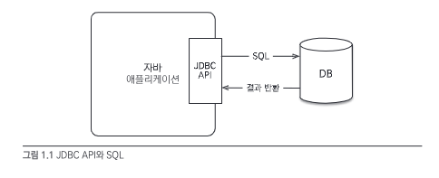
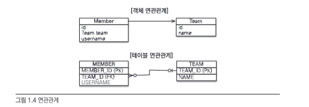
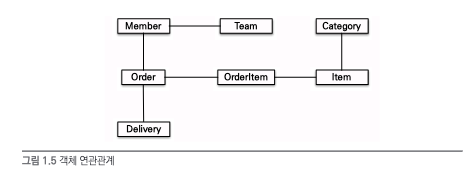
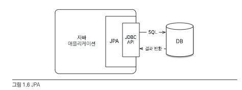

# Chapter 1. JPA 소개

## 목차

1. [SQL을 직접 다룰 때 발생하는 문제점](#sql을-직접-다룰-때-발생하는-문제점)
2. [패러다임의 불일치](#패러다임의-불일치)
3. [JPA란 무엇인가?](#jpa란-무엇인가)

## SQL을 직접 다룰 때 발생하는 문제점



### 반복, 반복 그리고 반복

객체를 데이터베이스에 CRUD하려면 너무 많은 SQL과 JDBC API를 코드로 작성해야 한다.

그리고 테이블마다 이런 비슷한 일을 반복해야 하는데, 개발하려는 애플리케이션에서 사용하는 테이블이 수십 개가 넘는다면?

데이터 접근 계층(DAO)를 개발하는 일은 이렇듯 반복적이고 지루한 작업이다.

### SQL에 의존적인 개발

SQL만으로 개발을 진행하다가, 요구사항이 변경된다면 어떻게 될까?

예를 들어, 회원 테이블에 전화번호 컬럼이 추가되었다고 가정해보자.

이런 경우, 회원 테이블과 관련된 **모든 SQL**을 찾아서 전화번호 컬럼을 추가해야 한다.

이렇게 SQL에 의존적인 개발을 진행하다가는, 요구사항이 변경될 때마다 SQL을 수정해야 하는 번거로움이 있다.

애플리케이션에서 SQL을 직접 다룰 때 발생하는 문제점을 요약하면 다음과 같다.

- 진정한 의미의 계층 분할이 어렵다.
- 엔티티를 신뢰할 수 없다.
- SQL에 의존적인 개발을 피하기 어렵다.

### JPA와 문제 해결

JPA를 사용하면 객체를 데이터베이스에 저장하고 관리할 때, 개발자가 직접 SQL을 작성하는 것이 아니라 JPA가 제공하는 API를 사용하면 된다.
그러면 JPA가 적절한 SQL을 생성해서 데이터베이스에 전달한다.

## 패러다임의 불일치

객체와 관계형 데이터베이스는 지향하는 목적이 서로 다르므로 둘의 기능과 표현 방법도 다르다.

이것을 객체와 관계형 데이터베이스의 `패러다임 불일치`라고 한다. 따라서 객체 구조를 테이블 구조에 저장하는 데는 한계가 있다.

### 상속


위 그림처럼 객체는 상속이라는 기능을 가지고 있지만 테이블은 상속이라는 기능이 없다.

> JPA와 상속

JPA는 상속과 관련된 패러다임의 불일치 문제를 개발자 대신 해결해준다. 개발자는 마치 자바 컬렉션에 객체를 저장하듯이 JPA에게 객체를 저장하면 된다.

### 연관관계



- 객체 : `참조`를 사용해서 관계를 맺고, 참조에 접근해서 연관된 객체를 조회한다.
- 테이블 : `외래 키`를 사용해서 관계를 맺고, 조인을 사용해서 연관된 테이블을 조회한다.

> JPA와 연관관계

JPA는 연관관계와 관련된 패러다임의 불일치 문제를 개발자 대신 해결해준다.

```java
member.setTeam(team); // 객체 연관관계 설정
jpa.persist(member); // 회원과 연관관계를 함께 저장
```

JPA는 team의 참조를 외래 키로 변환해서 적절한 INSERT SQL을 데이터베이스에 전달한다.
객체를 조회할 때 외래 키를 참조로 변환하는 일도 JPA가 처리해준다.

```java
Member member = jpa.find(Member.class, memberId);
Team team = member.getTeam();
```

### 객체 그래프 탐색

객체에서 회원이 소속된 팀을 조회할 때는 다음처럼 참조를 사용해서 연관된 팀을 찾으면 되는데, 이것을 객체 그래프 탐색이라 한다.

```java
Team team = member.getTeam();
```

객체 연관관계가 다음과 같이 설계되어 있다고 가정해보자.



예시로 `member.getOrder.getOrderItem()... // 자유로운 객체 그래프 탐색` 이런식으로 객체 그래프를 탐색할 수 있다.

하지만 SQL을 직접 다루면 처음 실행하는 SQL에 따라 객체 그래프 탐색이 결정된다. 이것은 객체지향 개발자에겐 너무 큰 제약이다. 왜냐하면 비즈니스 로직에 따라 사용하는
객체 그래프가 다른데 언제 끊어질지 모를 객체 그래프를 함부로 탐색할 수는 없기 때문이다.

```java
// 회원조회 비즈니스 로직
class MemberService {
    ...
    public void process() {
        Member member = memberDAO.find(memberId);
        member.getTeam(); // member -> team 객체 그래프 탐색이 가능한가?
        member.getOrder().getDelivery(); // ???
    }
}
```

위 코드처럼 어디까지 객체 그래프 탐색이 가능한지 알아보려면 DAO를 열서 직접 SQL을 확인해야 한다.

이것은 엔티티가 SQL에 논리적으로 종속되어서 발생하는 문제다.

> JPA와 객체 그래프 탐색

JPA를 사용하면 객체 그래프를 마음껏 탐색할 수 있다.

앞에서 언급했듯이 JPA는 연관된 객체를 사용하는 시점에 적절한 SELECT SQL을 실행한다. 따라서 JPA를 사용하면 연관된 객체를 신뢰하고 마음껏 조회할 수 있다.
이 기능은 실제 객체를 사용하는 시점까지 데이터베이스 조회를 미룬다고 해서 `지연 로딩`이라 한다.

```java
// 처음 조회 시점에 SELECT MEMBER SQL
Member member = jpa.find(Member.class, memberId);

Order order = member.getOrder();
order.getOrderDate(); // Order를 사용하는 시점에 SELECT ORDER SQL
```

또한 JPA는 같은 트랜잭션일 때 같은 객체가 조회되는 것을 보장한다.

```java
// 같은 트랜잭션 안에서는 같은 객체가 조회된다.
String memberId = "100";
Member member1 = jpa.find(Member.class, memberId);
Member member2 = jpa.find(Member.class, memberId);

System.out.println(member1 == member2); // true
```

## JPA란 무엇인가?

JPA(Java Persistence API)는 자바 진영의 ORM 기술 표준이다.



그렇다면 ORM은 무엇일까? ORM(Object-Relational Mapping)은 객체와 관계형 데이터베이스를 매핑한다는 뜻이다.

ORM 프레임워크는 객체와 테이블을 매핑해서 패러다임의 불일치 문제를 개발자 대신 해결해준다.


